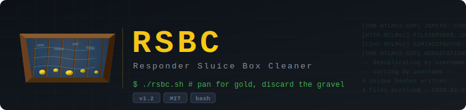

# ResponderSluiceBoxCleaner (RSBC)

<p align="center">
  
</p>

Like panning for gold — RSBC sifts through the pile of Responder (https://github.com/SpiderLabs/Responder) hash captures, filters out the duplicates, and leaves you with clean nuggets ready to crack.

**Author:** [SkyzFallin](https://github.com/SkyzFallin)

## What It Does
- Extracts all captured hash files from Responder's log directory
- Deduplicates by username + hash type (keeps one of each type per user)
- Preserves computer account hashes (e.g. `WORKSTATION$`) — never filtered or discarded
- Prefixes every output line with `[HASH_TYPE]` so you can immediately identify NTLMv1 vs NTLMv2-SSP without tracing back to source files
- Appends to an existing `responder_hashes.txt` if one is present — re-runs accumulate new captures without ever producing duplicates
- Outputs a single sorted `responder_hashes.txt` ready for Hashcat/John
- Archives processed files into a date-stamped folder for history tracking

## Quick Start
```bash
git clone https://github.com/SkyzFallin/ResponderSluiceBoxCleaner.git
cd ResponderSluiceBoxCleaner
chmod +x rsbc.sh
./rsbc.sh
```

Run Responder, run RSBC, run Responder again, run RSBC again — it just keeps building the master list cleanly.

## Output
| File/Folder | Location | Description |
|---|---|---|
| `responder_hashes.txt` | Current working directory | One unique hash per line, prefixed with `[HASH_TYPE]`, sorted by username. Appended to on subsequent runs. |
| `YYYY-MM-DD/` | `/usr/share/responder/logs/` | Archive folder with processed hash files from that run |

### Example output
```
[HTTP-NTLMv1]    FILESERVER$::CORP:aabbccdd:...
[SMB-NTLMv2-SSP] JSMITH::CORP:aabbccdd:...
[SMB-NTLMv2-SSP] WORKSTATION$::CORP:aabbccdd:...
[LDAP-NTLMv2]    ADMINISTRATOR::CORP:aabbccdd:...
```

## Deduplication Logic
Hashes are deduplicated by **username + hash type**. If a user has both an NTLMv1 and NTLMv2 capture, both are kept. Duplicate captures of the same hash type for the same user are removed (only the first is kept).

On subsequent runs, existing entries in `responder_hashes.txt` are pre-loaded into the deduplication index before scanning begins — so re-running after a new Responder session will only add genuinely new captures.

## Supported Hash Types
Handles all Responder hash file formats:
- NTLMv1 / NTLMv2-SSP
- HTTP / SMB / LDAP / MSSQL
- Any other `.txt` hash captures in the Responder logs directory

## Notes
- Session and config `.log` files are never touched
- Only top-level `.txt` files in the logs directory are processed — previously archived folders won't be re-scanned
- Computer account hashes (usernames ending in `$`) are fully preserved and archived alongside user hashes
- Running multiple times creates separate date-stamped archive folders
- Default Responder logs path: `/usr/share/responder/logs`

## Changelog
- **v1.2** — Append mode: if `responder_hashes.txt` already exists, existing entries are pre-loaded so re-runs never duplicate. Output is fully re-sorted after each run.
- **v1.1** — Computer account hashes explicitly preserved. Added `[HASH_TYPE]` prefix to all output lines.
- **v1.0** — Initial release.

## Credits

RSBC is a post-capture processing tool built around the output of these projects:

- **[Responder](https://github.com/SpiderLabs/Responder)** — The LLMNR/NBT-NS/mDNS poisoner that captures the hashes RSBC processes. By Laurent Gaffié / SpiderLabs. Licensed under [GPL-3.0](https://github.com/SpiderLabs/Responder/blob/master/LICENSE).
- **[Hashcat](https://hashcat.net/hashcat/)** — The GPU-accelerated password recovery tool RSBC's output is formatted for. Licensed under [MIT](https://github.com/hashcat/hashcat/blob/master/LICENSE.txt).
- **[John the Ripper](https://www.openwall.com/john/)** — Alternative password cracker also compatible with RSBC's output format. Licensed under [GPL-2.0](https://github.com/openwall/john/blob/bleeding-jumbo/doc/LICENSE).

## License
MIT
